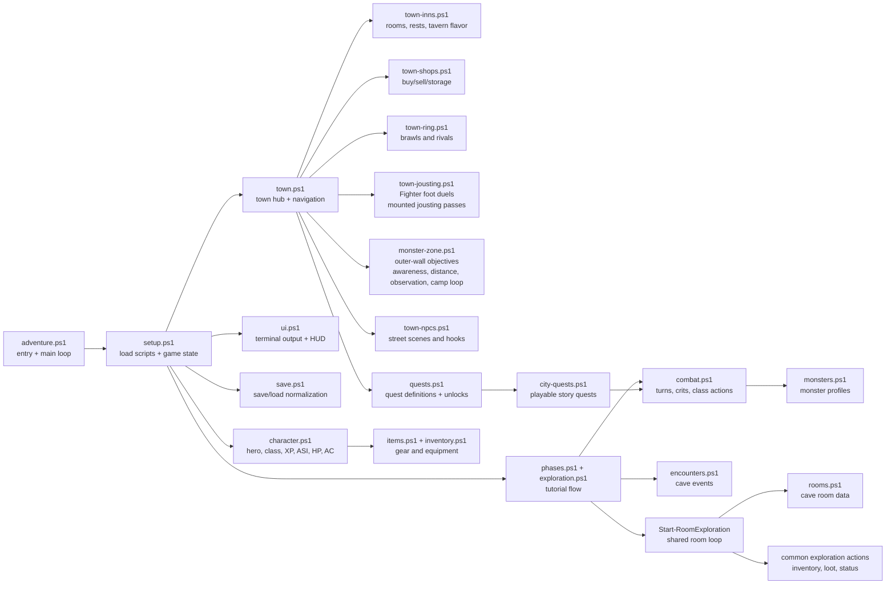

# Code Map

```mermaid
flowchart LR
    Adventure["adventure.ps1\nentry + main loop"] --> Setup["setup.ps1\nload scripts + game state"]
    Setup --> Character["character.ps1\nhero, class, XP, ASI, HP, AC"]
    Setup --> UI["ui.ps1\nterminal output + HUD"]
    Setup --> Save["save.ps1\nsave/load normalization"]
    Setup --> Town["town.ps1\ntown hub + navigation"]
    Setup --> Tutorial["phases.ps1 + exploration.ps1\ntutorial flow"]

    Tutorial --> ExploreCore["Start-RoomExploration\nshared room loop"]
    ExploreCore --> Rooms["rooms.ps1\ncave room data"]
    ExploreCore --> CommonActions["common exploration actions\ninventory, loot, status"]
    Tutorial --> Encounters["encounters.ps1\ncave events"]
    Tutorial --> Combat["combat.ps1\nturns, crits, class actions"]

    Town --> Inns["town-inns.ps1\nrooms, rests, tavern flavor"]
    Town --> Shops["town-shops.ps1\nbuy/sell/storage"]
    Town --> Ring["town-ring.ps1\nbrawls and rivals"]
    Town --> Jousting["town-jousting.ps1\nFighter foot duels\nmounted jousting passes"]
    Town --> MonsterZone["monster-zone.ps1\nouter-wall objectives\nawareness, distance, observation, camp loop"]
    Town --> NPCs["town-npcs.ps1\nstreet scenes and hooks"]
    Town --> QuestDefs["quests.ps1\nquest definitions + unlocks"]
    QuestDefs --> CityQuests["city-quests.ps1\nplayable story quests"]
    CityQuests --> Combat
    Combat --> Monsters["monsters.ps1\nmonster profiles"]
    Character --> Items["items.ps1 + inventory.ps1\ngear and equipment"]
```
