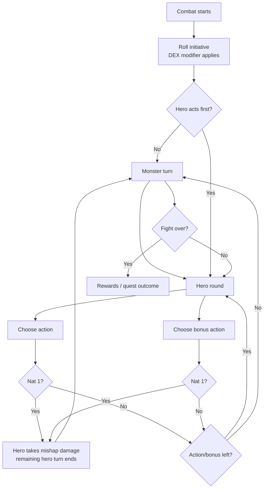
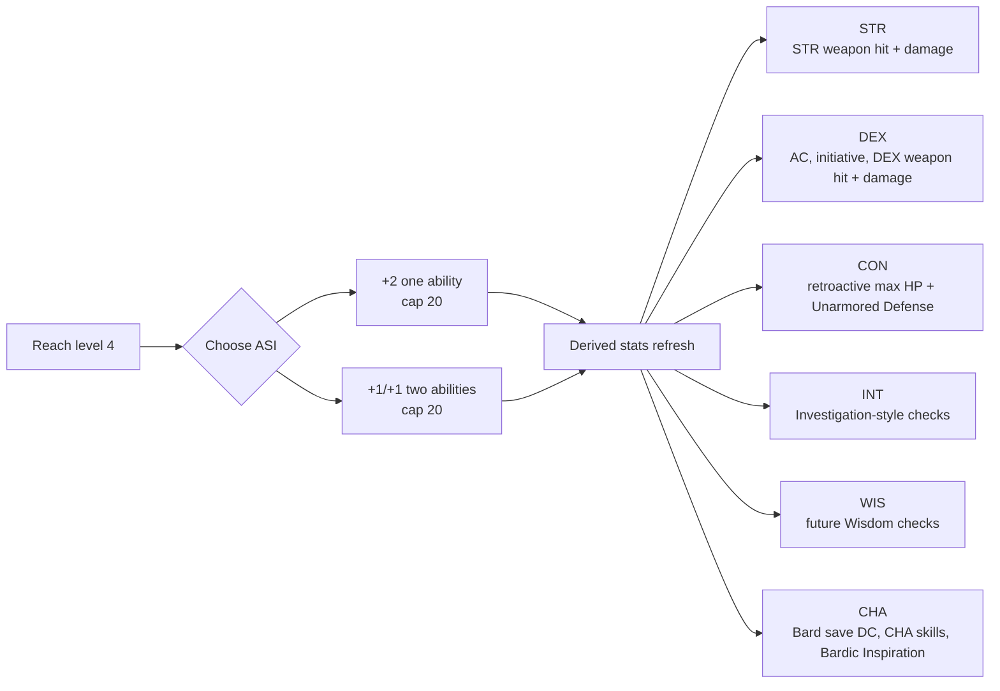

# Combat and Leveling

## Combat Turn

```mermaid
flowchart TD
    StartCombat["Combat starts"] --> Initiative["Roll initiative\nDEX modifier applies"]
    Initiative --> HeroTurn{"Hero acts first?"}
    HeroTurn -- "No" --> MonsterTurn["Monster turn"]
    MonsterTurn --> HeroRound["Hero round"]
    HeroTurn -- "Yes" --> HeroRound

    HeroRound --> ActionChoice["Choose action"]
    HeroRound --> BonusChoice["Choose bonus action"]
    ActionChoice --> ActionResult{"Nat 1?"}
    BonusChoice --> BonusResult{"Nat 1?"}

    ActionResult -- "Yes" --> CritFail["Hero takes mishap damage\nremaining hero turn ends"]
    BonusResult -- "Yes" --> CritFail
    ActionResult -- "No" --> ContinueTurn{"Action/bonus left?"}
    BonusResult -- "No" --> ContinueTurn
    ContinueTurn -- "Yes" --> HeroRound
    ContinueTurn -- "No" --> MonsterTurn

    MonsterTurn --> CombatEnd{"Fight over?"}
    CritFail --> MonsterTurn
    CombatEnd -- "No" --> HeroRound
    CombatEnd -- "Yes" --> Rewards["Rewards / quest outcome"]
```

## Level 4 Ability Score Increase

```mermaid
flowchart LR
    Level4["Reach level 4"] --> ASIChoice{"Choose ASI"}
    ASIChoice --> PlusTwo["+2 one ability\ncap 20"]
    ASIChoice --> Split["+1/+1 two abilities\ncap 20"]

    PlusTwo --> Derived["Derived stats refresh"]
    Split --> Derived

    Derived --> STR["STR\nSTR weapon hit + damage"]
    Derived --> DEX["DEX\nAC, initiative, DEX weapon hit + damage"]
    Derived --> CON["CON\nretroactive max HP + Unarmored Defense"]
    Derived --> INT["INT\nInvestigation-style checks"]
    Derived --> WIS["WIS\nfuture Wisdom checks"]
    Derived --> CHA["CHA\nBard save DC, CHA skills, Bardic Inspiration"]
```
