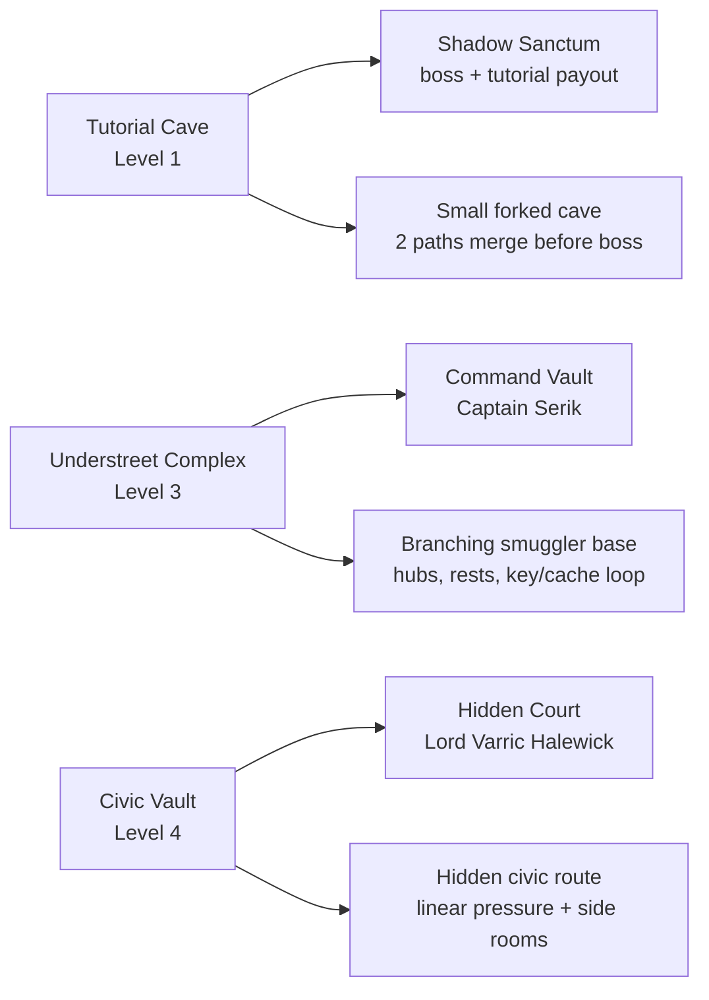

# Dungeon Maps

Det har dokumentet visar dungeon-layouts som top-down sketches.

Formatet ar medvetet kartlikt:

- rummen ligger dar de ungefar ligger i nord/syd/ost/vast
- kartan anvander korta rumskoder for att inte bli for bred
- legend under kartan forklarar namn, funktion och specialinnehall

## Symbols

- `S` = start / entry
- `B` = boss room
- `R` = short rest room
- `K` = key / important unlock
- `C` = cache / locked reward
- `!` = encounter pressure
- `?` = clue / search focus

---

## Dungeon Overview



---

## Tutorial Cave

```text
                         N
                         ^
                         |
              [CC] --- [AT] --- [SS B]
               |        |
               |        |
              [EH]    [UL]
               |        |
               |        |
              [CE S]--[FN]
```

Legend:

- `[CE S]` Cave Entrance: start room, can leave cave.
- `[EH]` Echo Hall: dry/bone route, high encounter pressure.
- `[FN]` Fungal Nest: wet/fungal route, high encounter pressure.
- `[CC]` Collapsed Crossing: upper route toward the merge.
- `[UL]` Underground Lake: lower route toward the merge.
- `[AT]` Ashen Threshold: both routes converge before the final room.
- `[SS B]` Shadow Sanctum: boss room and tutorial reward moment.

Design read:

- The cave has a strong beginner shape: fork, explore, merge, boss.
- `Ashen Threshold` does good work as the final breath before the boss.
- The lower route feels more organic/wet, while the upper route feels more ruined/structural.

---

## Understreet Complex

```text
                                      N
                                      ^
                                      |
                         [CB R]
                           |
                         [ST !] --- [FS !] --- [OA ! C] --- [SL !]
                           |           |          |
                           |           |          |
[SD S] --- [CH !] ------- [TC] ------ [RC !] --- [CV B]
             |             |
             |             |
           [CR R]        [SG ?]
                           |
                         [WC K]
```

Legend:

- `[SD S]` Sealed Descent: entry from the city route.
- `[CH !]` Contraband Hall: first major pressure room and west-side hub.
- `[CR R]` Cistern Refuge: short rest dead end below Contraband Hall.
- `[ST !]` Sentry Turn: north branch encounter.
- `[CB R]` Collapsed Barracks: short rest dead end above Sentry Turn.
- `[FS !]` Flooded Switchback: hound encounter, connects top branch to armory.
- `[TC]` Tally Crossing: central navigation hub.
- `[SG ?]` Sump Gallery: clue/search branch.
- `[WC K]` Whisper Cells: armory key branch.
- `[OA ! C]` Old Armory: encounter plus locked cache payoff.
- `[SL !]` Smugglers' Lockup: risky dead end off the armory.
- `[RC !]` Record Chamber: evidence route and final guard before the boss.
- `[CV B]` Command Vault: boss room.

Primary route:

```text
[SD S] -> [CH !] -> [TC] -> [RC !] -> [CV B]
```

Optional pressure / reward loop:

```text
[TC] -> [SG ?] -> [WC K] -> [TC] -> [RC !] -> [OA ! C]
```

Design read:

- This is the best dungeon shape right now: two hubs, several meaningful side branches, and a clear finale lane.
- The rest rooms are placed as safe-feeling dead ends, which makes them readable.
- The `Whisper Cells` to `Old Armory` key/cache loop gives the dungeon a real exploration reward.
- If we polish this later, the map could become even stronger by making the north route feel like a dangerous shortcut or alternate approach to `Record Chamber`.

---

## Civic Vault

```text
                                      N
                                      ^
                                      |
                         [MC K]
                           |
[HC S] --- [SL !] ------- [PG !] --- [SS R] --- [CA ? C] --- [WR !] --- [HCt B]
             |
           [LR R]
```

Legend:

- `[HC S]` Hidden Culvert: Docks-side entry under the Civic Keep.
- `[SL !]` Seal Lift: first encounter and first small hub.
- `[LR R]` Ledger Refuge: short rest and supplies below the lift.
- `[PG !]` Petition Gallery: second hub and social-horror pressure room.
- `[MC K]` Mirror Cells: archive key side room.
- `[SS R]` Servant Sluice: short rest before the final pressure lane.
- `[CA ? C]` Charter Archive: Halewick proof plus locked coffer.
- `[WR !]` Private War Room: knight encounter before the boss.
- `[HCt B]` Hidden Court: boss room with Lord Varric Halewick.

Primary route:

```text
[HC S] -> [SL !] -> [PG !] -> [SS R] -> [CA ? C] -> [WR !] -> [HCt B]
```

Side-room rhythm:

```text
[SL !] -> [LR R]
[PG !] -> [MC K]
```

Design read:

- Civic Vault is much more linear than Understreet, which fits the feeling of a hidden service route under a seat of power.
- The side rooms are cleanly placed: one rest room at the first hub, one key room at the second hub.
- `Servant Sluice` creates a good calm-before-the-storm beat before archive, war room, and boss.
- If we want this dungeon to feel grander later, the next improvement would be adding one more loop around `Charter Archive` so the final third is not only a straight line.
