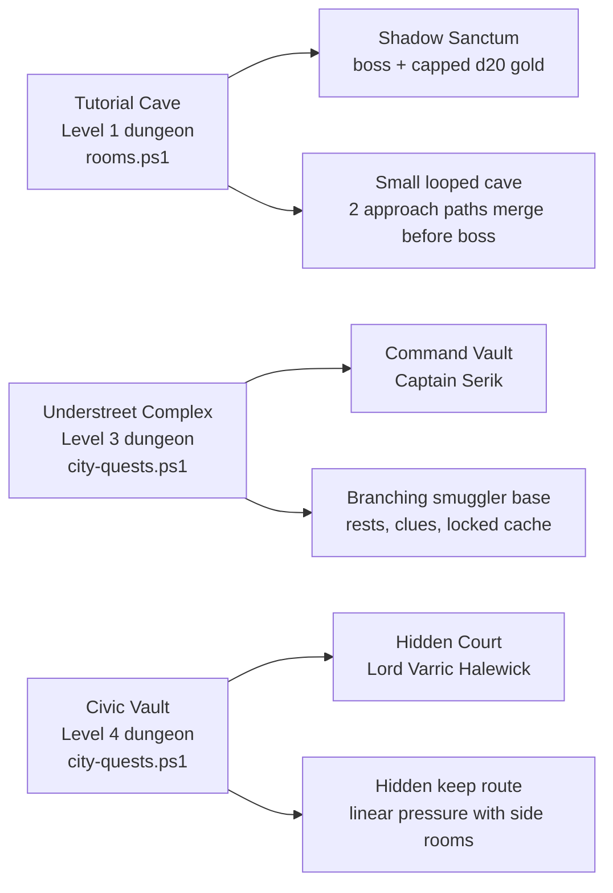

# Dungeon Maps

## Dungeon Overview



## Tutorial Cave Map

Top-down sketch:

```text
                                      N
                                      ^
                                      |
                         +-----------------------+      +-----------------------+      +-----------------------+
                         | Collapsed Crossing    |------| Ashen Threshold       |------| Shadow Sanctum        |
                         | broken bridge         | E/W  | paths converge        | E/W  | boss room             |
                         +-----------------------+      +-----------------------+      +-----------------------+
                                      |                            |
                                      | N/S                        | N/S
                                      |                            |
                         +-----------------------+      +-----------------------+
                         | Echo Hall             |      | Underground Lake      |
                         | bones + echoes        |      | black water           |
                         +-----------------------+      +-----------------------+
                                      |                            |
                                      | N/S                        | N/S
                                      |                            |
+-----------------------+      +-----------------------+
| Cave Entrance         |------| Fungal Nest           |
| start / can leave     | E/W  | glowing fungus        |
+-----------------------+      +-----------------------+
```

Design read:

- The cave has two early routes: a dry/bone path through `Echo Hall` and a wet/fungal path through `Fungal Nest`.
- Both routes bend into `Ashen Threshold`, making the boss approach feel intentional instead of random.
- `Shadow Sanctum` sits far east as the clear final room.

## Understreet Complex Map

Top-down sketch:

```text
                                      N
                                      ^
                                      |
                         +-----------------------+
                         |  Collapsed Barracks   |
                         |  short rest dead end  |
                         +-----------------------+
                                      |
                                      |
                         +-----------------------+      +-----------------------+      +-----------------------+      +-----------------------+
                         |  Sentry Turn          |------| Flooded Switchback    |------| Old Armory            |
                         |  sentry encounter     |      | hound encounter       |      | warden + locked cache |
                         +-----------------------+      +-----------------------+      +-----------------------+      | Smugglers' Lockup    |
                                      |                            |                         |                    | gaoler dead end      |
                                      |                            |                         |                    +-----------------------+
+-----------------------+   +-----------------------+      +-----------------------+      +-----------------------+      +-----------------------+
| Sealed Descent        |---| Contraband Hall       |------| Tally Crossing        |------| Record Chamber        |------| Command Vault         |
| entry                 |   | lookout encounter     |      | central junction      |      | record keeper         | E/W  | boss room             |
+-----------------------+   +-----------------------+      +-----------------------+      +-----------------------+      +-----------------------+
                                      |                            |                         |
                                      |                            |                         |
                         +-----------------------+      +-----------------------+         |
                         | Cistern Refuge        |      | Sump Gallery          |---------+
                         | short rest dead end   |      | search clue           |
                         +-----------------------+      +-----------------------+
                                                                   |
                                                                   |
                                                       +-----------------------+
                                                       | Whisper Cells         |
                                                       | armory key            |
                                                       +-----------------------+
```

Cleaner route view:

```text
Sealed Descent -> Contraband Hall -> Tally Crossing -> Record Chamber -> Command Vault
                         |                |                ^
                         |                |                |
                  Cistern Rest       Sump Gallery      Old Armory
                                           |                |
                                      Whisper Cells     Smugglers' Lockup
                         |
                    Sentry Turn -> Flooded Switchback -> Old Armory
                         |
                  Collapsed Barracks Rest
```

Design read:

- `Contraband Hall` and `Tally Crossing` are the two real navigation hubs.
- Rest rooms sit as defensible dead ends, which makes them readable and useful.
- `Whisper Cells` feeds the armory-key loop; `Old Armory` then becomes a reward/risk branch before the boss route.
- `Command Vault` is placed at the end of the evidence route, which makes the finale feel like the heart of the operation.

## Civic Vault Map

Top-down sketch:

```text
                                      N
                                      ^
                                      |
                                                       +-----------------------+
                                                       | Mirror Cells          |
                                                       | archive key           |
                                                       +-----------------------+
                                                                   |
                                                                   |
+-----------------------+      +-----------------------+      +-----------------------+      +-----------------------+      +-----------------------+      +-----------------------+      +-----------------------+
| Hidden Culvert        |------| Seal Lift             |------| Petition Gallery      |------| Servant Sluice        |------| Charter Archive       |------| Private War Room      |------| Hidden Court          |
| Docks entry           | E/W  | warden encounter      | E/W  | advocate encounter    | E/W  | short rest            | E/W  | proof + locked coffer | E/W  | knight encounter      | E/W  | boss room             |
+-----------------------+      +-----------------------+      +-----------------------+      +-----------------------+      +-----------------------+      +-----------------------+      +-----------------------+
                                      |
                                      |
                         +-----------------------+
                         | Ledger Refuge         |
                         | short rest + supplies |
                         +-----------------------+
```

Design read:

- The Civic Vault is intentionally more linear than Understreet.
- `Seal Lift` is the first hub: one safe side room and one forward route.
- `Petition Gallery` is the second hub: one key side room and one forward route.
- `Servant Sluice` gives a rest before the archive/war-room/boss pressure lane.
- `Hidden Court` sits after `Private War Room`, so the boss feels protected by civic power rather than hidden in a random back room.
