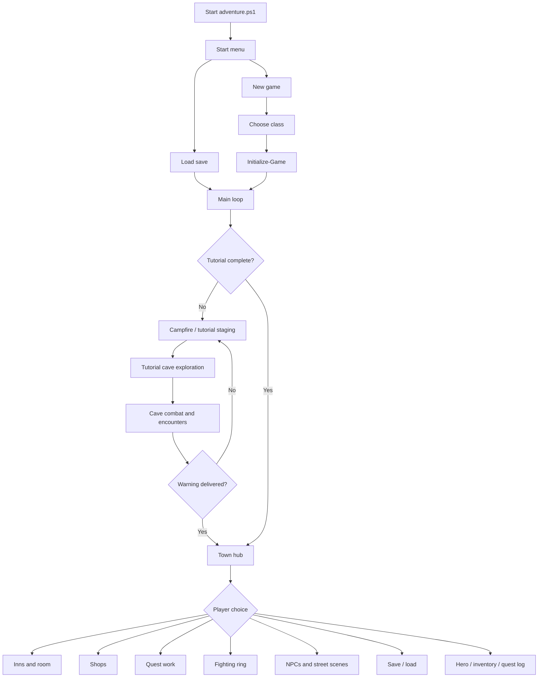
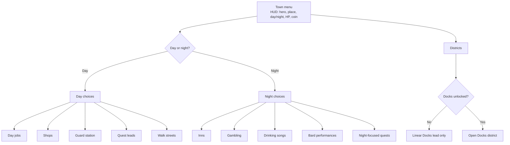

# Game and Town Flow

## Game Flow

```mermaid
flowchart TD
    Start["Start adventure.ps1"] --> Menu["Start menu"]
    Menu --> NewGame["New game"]
    Menu --> LoadGame["Load save"]
    NewGame --> ClassSelect["Choose class"]
    ClassSelect --> Init["Initialize-Game"]
    LoadGame --> MainLoop["Main loop"]
    Init --> MainLoop

    MainLoop --> TutorialGate{"Tutorial complete?"}
    TutorialGate -- "No" --> Campfire["Campfire / tutorial staging"]
    Campfire --> Cave["Tutorial cave exploration"]
    Cave --> CaveCombat["Cave combat and encounters"]
    CaveCombat --> TutorialDone{"Warning delivered?"}
    TutorialDone -- "No" --> Campfire
    TutorialDone -- "Yes" --> Town["Town hub"]

    TutorialGate -- "Yes" --> Town
    Town --> TownChoice{"Player choice"}
    TownChoice --> Inns["Inns and room"]
    TownChoice --> Shops["Shops"]
    TownChoice --> Quests["Quest work"]
    TownChoice --> Ring["Fighting ring"]
    TownChoice --> Streets["NPCs and street scenes"]
    TownChoice --> Save["Save / load"]
    TownChoice --> Status["Hero / inventory / quest log"]
```

## Town Hub

```mermaid
flowchart TD
    Town["Town menu\nHUD: hero, place, day/night, HP, coin"] --> Time{"Day or night?"}

    Time -- "Day" --> DayChoices["Day choices"]
    DayChoices --> DayJobs["Day jobs"]
    DayChoices --> Shops["Shops"]
    DayChoices --> Guard["Guard station"]
    DayChoices --> QuestLeads["Quest leads"]
    DayChoices --> Streets["Walk streets"]

    Time -- "Night" --> NightChoices["Night choices"]
    NightChoices --> Inns["Inns"]
    NightChoices --> Gambling["Gambling"]
    NightChoices --> DrinkingSongs["Drinking songs"]
    NightChoices --> BardShows["Bard performances"]
    NightChoices --> NightQuests["Night-focused quests"]

    Town --> Districts["Districts"]
    Districts --> DocksGate{"Docks unlocked?"}
    DocksGate -- "No" --> DocksLead["Linear Docks lead only"]
    DocksGate -- "Yes" --> Docks["Open Docks district"]
```
