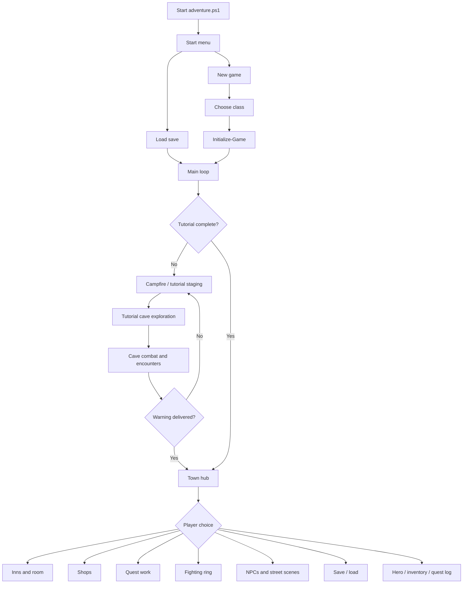
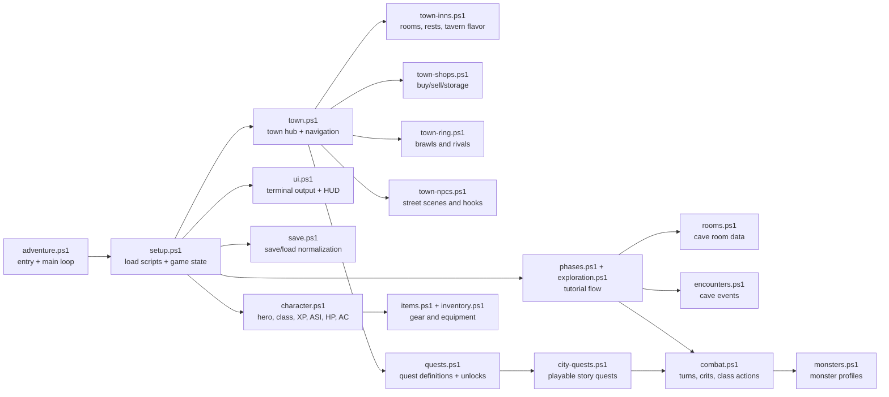
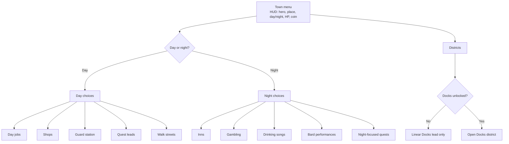
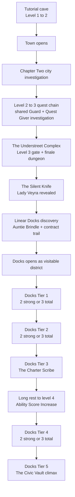
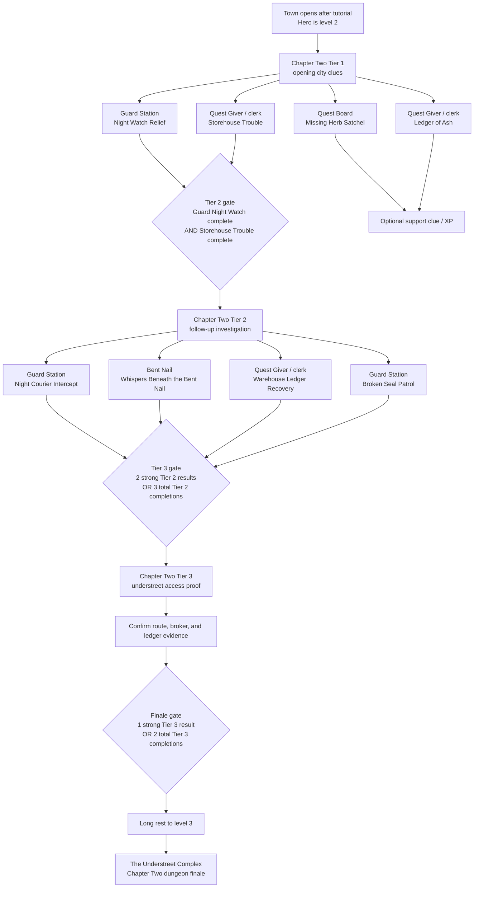
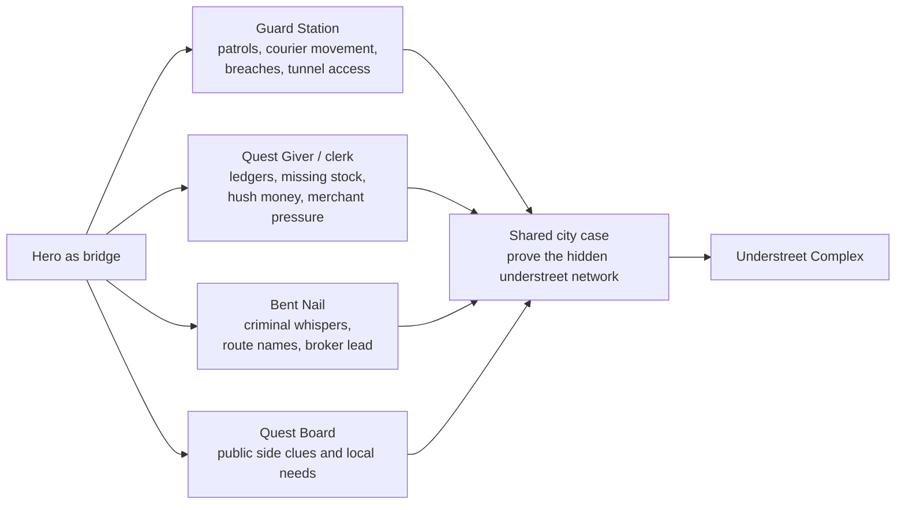
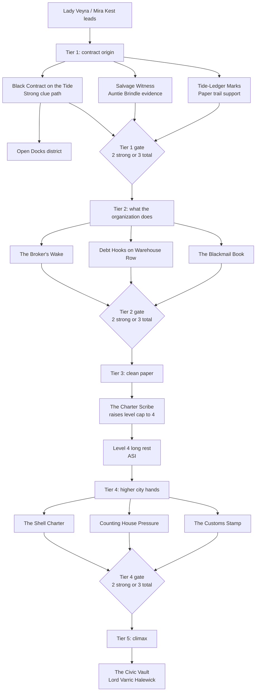
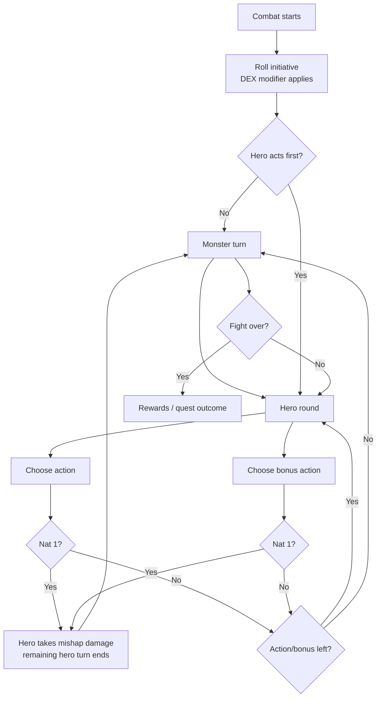
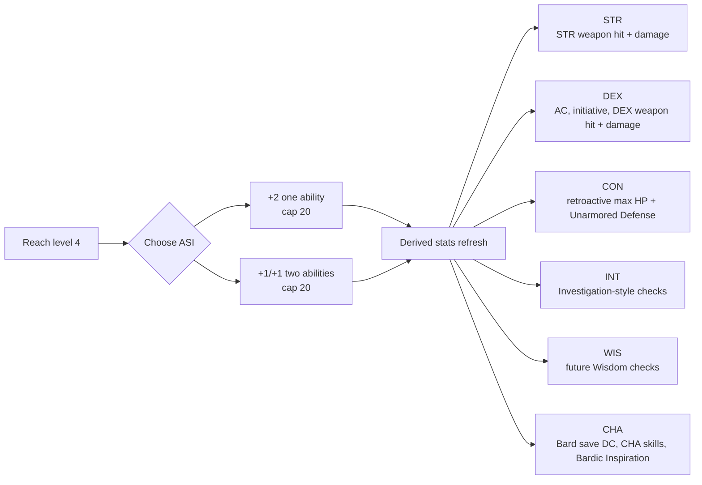

# Visualizations

Det har dokumentet ar en visuell karta over spelet och koden.

Tanken ar inte att ersatta de andra dokumenten. Det ska vara en snabb "se helheten"-vy innan man gar in i detaljerna.

---

## Game Flow

## Code Map

## Town Hub

## Story Progression

## Level 2-3 City Quest Chain

## Level 2-3 Lead Sources

## Docks Quest Tiers

## Combat Turn

## Level 4 Ability Score Increase

---

## How To Use This

- Use `Game Flow` when debugging where the player should go next.
- Use `Code Map` when deciding which file to edit.
- Use `Town Hub` when polishing menus or day/night behavior.
- Use `Story Progression`, `Level 2-3 City Quest Chain`, and `Docks Quest Tiers` when adding quests.
- Use `Combat Turn` when changing action economy, crit fail, or class features.
- Use `Level 4 Ability Score Increase` when adding more derived stats or new classes.
